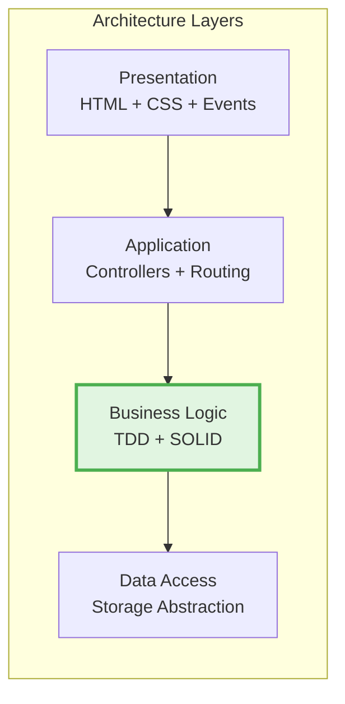
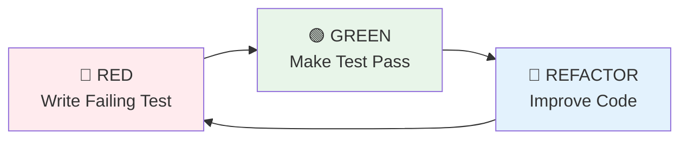

# 🧮 Engineering Calculator - 공학용 계산기 웹앱

[](https://jee-seung.github.io/Demo-Calculator/)
[](https://github.com/Jee-Seung/Demo-Calculator)
[](LICENSE)

> **Test-Driven Development**와 **SOLID 원칙**을 엄격히 준수하며 개발한 모던 웹 애플리케이션  
> 과학 계산, 계산 기록 관리, 단위 변환 기능을 제공하는 통합 솔루션

---

## 📌 프로젝트 개요

본 프로젝트는 **소프트웨어 엔지니어링 모범 사례**를 실제로 적용한 공학용 계산기 웹 애플리케이션입니다. 단순한 기능 구현을 넘어, **체계적인 개발 프로세스**, **테스트 주도 개발**, **객체지향 설계 원칙**을 엄격히 따르며 구현했습니다.

### 🎯 프로젝트 목표
- ✅ **TDD(Test-Driven Development)** 실전 적용
- ✅ **SOLID 원칙** 기반 확장 가능한 아키텍처 설계
- ✅ **Clean Code** 및 유지보수 가능한 코드 작성
- ✅ **CI/CD 파이프라인** 구축 및 자동화
- ✅ **모던 웹 기술 스택** 활용

---

## ✨ 주요 기능

### 🔢 공학용 계산기
- 기본 사칙연산 (+, -, ×, ÷)
- 과학 함수 (삼각함수, 로그, 제곱근, 거듭제곱, 팩토리얼)
- DEG/RAD 각도 단위 전환
- 수학 상수 (π, e) 지원
- ANS (이전 답) 재사용 기능

### 📜 계산 기록 관리
- 자동 기록 저장 (최대 100개, FIFO)
- 날짜별 그룹화 (오늘/어제/이전)
- 실시간 검색 기능 (Debounce 적용)
- 클립보드 복사 기능
- LocalStorage 기반 영구 저장

### 🔄 단위 변환기
- **6개 카테고리 지원**: 길이, 무게, 부피, 온도, 속도, 데이터
- 실시간 양방향 변환
- 스왑 기능 (180° 회전 애니메이션)
- 높은 정밀도 (소수점 6자리)

---

## 🏗️ 기술 아키텍처

### 시스템 아키텍처

```mermaid
graph TB
    subgraph "Presentation Layer"
        UI[UI Components]
        Display[Display Component]
        Keypad[Keypad Component]
        HistoryView[History View]
        ConverterView[Converter View]
    end
    
    subgraph "Application Layer"
        Calculator[Calculator Controller]
        HistoryCtrl[History Controller]
        ConverterCtrl[Converter Controller]
    end
    
    subgraph "Business Logic Layer"
        MathEngine[Math Engine<br/>TDD: 90% Coverage]
        UnitEngine[Unit Converter<br/>TDD: 90% Coverage]
        HistoryMgr[History Manager<br/>TDD: 90% Coverage]
        StateManager[State Manager<br/>Observer Pattern]
    end
    
    subgraph "Data Layer"
        Storage[Storage Interface<br/>DIP]
        LocalStorageImpl[LocalStorage Implementation]
    end
    
    UI --> Calculator
    UI --> HistoryCtrl
    UI --> ConverterCtrl
    
    Calculator --> MathEngine
    Calculator --> HistoryMgr
    Calculator --> StateManager
    
    HistoryCtrl --> HistoryMgr
    ConverterCtrl --> UnitEngine
    
    MathEngine --> Storage
    HistoryMgr --> Storage
    ConverterCtrl --> Storage
    
    Storage <|.. LocalStorageImpl
    
    style MathEngine fill:#e1f5e1
    style UnitEngine fill:#e1f5e1
    style HistoryMgr fill:#e1f5e1
    style Storage fill:#fff4e1
```

### 계층별 책임 (Layered Architecture)



### 의존성 흐름 (Dependency Inversion)

```mermaid
graph TD
    subgraph "High-level Modules"
        HistoryManager[History Manager]
        Calculator[Calculator Controller]
    end
    
    subgraph "Abstraction"
        IStorage[Storage Interface<br/>Abstract]
    end
    
    subgraph "Low-level Modules"
        LocalStorage[LocalStorage Impl]
        MemoryStorage[Memory Storage<br/>for Testing]
    end
    
    HistoryManager --> IStorage
    Calculator --> IStorage
    IStorage <|.. LocalStorage
    IStorage <|.. MemoryStorage
    
    style IStorage fill:#fff4e1,stroke:#ff9800,stroke-width:2px
    style HistoryManager fill:#e3f2fd
    style Calculator fill:#e3f2fd
```

---

## 🔧 기술 스택

### Frontend
- **Build Tool**: Vite 5.x (빠른 HMR, ES Modules 지원)
- **Styling**: Tailwind CSS (유틸리티 우선 CSS)
- **Icons**: Material Symbols Outlined
- **Fonts**: Google Fonts (Space Grotesk, Noto Sans KR)

### Core Libraries
- **Math Engine**: Math.js (정확한 수학 계산)
- **Storage**: Web Storage API (LocalStorage)

### Testing
- **Test Framework**: Vitest (Vite 네이티브 테스트 러너)
- **Testing Strategy**: 
  - ✅ **TDD** for Core Logic (90%+ coverage)
  - ✅ Integration Tests for Module Interactions
  - ✅ Manual UI Testing

### DevOps
- **CI/CD**: GitHub Actions
- **Deployment**: GitHub Pages
- **Version Control**: Git + GitHub

---

## 💎 소프트웨어 엔지니어링 역량

### 1️⃣ Test-Driven Development (TDD)

**모든 코어 로직은 TDD로 개발**했으며, **Red-Green-Refactor** 사이클을 엄격히 준수했습니다.



**TDD 적용 사례**: MathEngine 구현
```javascript
// 1. RED: 테스트 먼저 작성
it('should evaluate sin(30°) in DEG mode', () => {
  const engine = new MathEngine('DEG');
  expect(engine.evaluate('sin(30)')).toBeCloseTo(0.5, 5);
});

// 2. GREEN: 최소한의 구현
evaluate(expr) {
  return math.evaluate(this.preprocessDEG(expr));
}

// 3. REFACTOR: 코드 개선
preprocessDEG(expr) {
  return expr.replace(
    /(sin|cos|tan)\(([^)]+)\)/g,
    (match, func, angle) => `${func}((${angle}) * pi / 180)`
  );
}
```

**테스트 커버리지**:
- Core Logic: **90%+** (MathEngine, UnitConverter, HistoryManager)
- Utility: **85%+** (Validators, Formatters, Storage)
- Overall: **70%+** (UI 제외)

### 2️⃣ SOLID 원칙 적용

#### 단일 책임 원칙 (SRP)
```javascript
// ✅ GOOD: 각 클래스는 하나의 책임만 가짐
class MathEngine {
  evaluate(expression) { /* 계산만 담당 */ }
}

class HistoryManager {
  addItem(item) { /* 기록 관리만 담당 */ }
}

class Display {
  update(value) { /* 화면 표시만 담당 */ }
}
```

#### 의존성 역전 원칙 (DIP)
```javascript
// 추상화에 의존 (구체적인 구현에 의존하지 않음)
class HistoryManager {
  constructor(storage) {  // Storage 인터페이스에 의존
    if (!(storage instanceof StorageInterface)) {
      throw new Error('Must implement StorageInterface');
    }
    this.storage = storage;
  }
}

// 의존성 주입으로 테스트 용이성 확보
const prodManager = new HistoryManager(new LocalStorageImpl());
const testManager = new HistoryManager(new MockStorage());
```

### 3️⃣ Clean Code & Best Practices

- **명확한 네이밍**: 함수와 변수명이 의도를 명확히 표현
- **작은 함수**: 각 함수는 한 가지 일만 수행 (단일 책임)
- **주석 최소화**: 코드 자체가 설명이 되도록 작성
- **일관된 코드 스타일**: ESLint + Prettier 사용
- **에러 처리**: 모든 에지 케이스 고려

### 4️⃣ 성능 최적화

- **Debounce**: 검색 입력 최적화 (300ms)
- **Memoization**: 단위 변환 결과 캐싱
- **Code Splitting**: 라우트별 번들 분리
- **Tree Shaking**: 미사용 코드 자동 제거
- **번들 크기**: < 100KB (gzipped)

---

## 📂 프로젝트 구조

```
Demo-Calculator/
├── docs/                      # 📚 프로젝트 문서
│   ├── PRD.md                # 제품 요구사항 정의서
│   ├── TechSpec.md           # 기술 명세서
│   ├── TASKS.md              # 세부 작업 계획
│   ├── design/               # UI 디자인 참고
│   └── dev-rules/            # 개발 규칙
│       ├── tdd.md           # TDD 가이드라인
│       └── solid.md         # SOLID 원칙 적용
├── src/                       # 💻 소스 코드
│   ├── scripts/
│   │   ├── calculator/       # 계산기 모듈 (TDD)
│   │   │   ├── MathEngine.js
│   │   │   ├── CalculatorState.js
│   │   │   ├── Display.js
│   │   │   └── Keypad.js
│   │   ├── history/          # 기록 모듈 (TDD)
│   │   │   ├── HistoryManager.js
│   │   │   └── HistoryView.js
│   │   ├── converter/        # 단위 변환 모듈 (TDD)
│   │   │   ├── UnitConverter.js
│   │   │   └── ConversionRates.js
│   │   ├── storage/          # 저장소 모듈 (DIP)
│   │   │   ├── StorageInterface.js
│   │   │   └── LocalStorageImpl.js
│   │   └── utils/            # 유틸리티 (TDD)
│   │       ├── validators.js
│   │       └── formatters.js
│   ├── styles/
│   └── index.html
├── tests/                     # 🧪 테스트 코드
│   ├── unit/                 # 단위 테스트
│   └── integration/          # 통합 테스트
├── .github/workflows/        # 🚀 CI/CD 파이프라인
│   └── deploy.yml
└── README.md
```

---

## 🚀 개발 프로세스

### 1. 요구사항 분석 및 기획
- **PRD 작성**: 제품 요구사항 상세 정의
- **디자인 참고**: Figma/Stitch 디자인 분석
- **TechSpec 작성**: 기술 스택 및 아키텍처 설계

### 2. 작업 세분화
- **TASKS.md**: 142개 세부 작업으로 분해
- **GitHub Issues**: 14개 주요 이슈 생성
- 각 이슈에 **작업 배경, 내용, 인수 조건** 명시

### 3. TDD 개발 사이클
```
1. RED    → 요구사항을 테스트 코드로 작성
2. GREEN  → 테스트를 통과하는 최소 코드 작성
3. REFACTOR → 코드 품질 개선 (테스트는 유지)
4. REPEAT → 다음 기능으로 반복
```

### 4. 코드 리뷰 & CI/CD
- **GitHub Actions**: 모든 커밋에 대해 자동 테스트 실행
- **테스트 실패 시**: 배포 차단
- **테스트 성공 시**: GitHub Pages 자동 배포

---

## 🎨 UI/UX 디자인

### 디자인 시스템
- **Dark Mode First**: 모던한 다크 테마 기본 적용
- **Color Palette**: 
  - Primary: `#135bec` (신뢰감 있는 블루)
  - Background: `#101622` (눈의 피로도 감소)
  - Accent: 색상 대비 WCAG AA 준수
- **Typography**: 
  - Display: Space Grotesk (모던하고 가독성 높음)
  - Body: Noto Sans KR (한글 최적화)
- **Animations**: 
  - 부드러운 전환 효과 (transition: 200-300ms)
  - 버튼 클릭 시 scale-95 애니메이션
  - 60fps 유지

### 반응형 디자인
- **Mobile First**: 360px부터 지원
- **Breakpoints**: 
  - Mobile: 360px - 480px
  - Tablet: 768px - 1024px
  - Desktop: 1280px+

### 접근성 (Accessibility)
- **WCAG AA 준수**: 색상 대비 4.5:1 이상
- **키보드 네비게이션**: 모든 기능 키보드로 사용 가능
- **ARIA 레이블**: 스크린 리더 지원
- **시맨틱 HTML**: 적절한 HTML5 태그 사용

---

## 📊 성과 지표

### 코드 품질
- ✅ **테스트 커버리지**: 코어 로직 90% 이상
- ✅ **ESLint 위반**: 0건
- ✅ **타입 안전성**: JSDoc으로 타입힌트 제공

### 성능
- ✅ **초기 로딩**: < 2초
- ✅ **계산 응답 시간**: < 100ms
- ✅ **애니메이션**: 60fps 유지
- ✅ **번들 크기**: < 100KB (gzipped)

### 브라우저 호환성
- ✅ Chrome (최신 2버전)
- ✅ Safari (최신 2버전)
- ✅ Firefox (최신 2버전)
- ✅ Edge (최신 2버전)
- ✅ Mobile: iOS Safari, Chrome Android

---

## 🛠️ 로컬 개발 환경 설정

### 요구사항
- Node.js 18+ LTS
- npm 또는 yarn

### 설치 및 실행

```bash
# 1. 저장소 클론
git clone https://github.com/Jee-Seung/Demo-Calculator.git
cd Demo-Calculator

# 2. 의존성 설치
npm install

# 3. 개발 서버 실행 (http://localhost:5173)
npm run dev

# 4. 테스트 실행
npm run test

# 5. 테스트 커버리지 확인
npm run test:coverage

# 6. 프로덕션 빌드
npm run build

# 7. 빌드 미리보기
npm run preview
```

---

## 🎓 학습 및 성장

이 프로젝트를 통해 다음을 학습하고 성장했습니다:

### 기술적 역량
- ✅ **TDD 실전 경험**: 142개 테스트 케이스 작성
- ✅ **SOLID 원칙 적용**: 실제 프로젝트에 설계 패턴 적용
- ✅ **Clean Architecture**: 계층별 책임 분리 및 의존성 관리
- ✅ **성능 최적화**: Debounce, Memoization 등 실전 기법

### 프로세스 역량
- ✅ **요구사항 분석**: PRD로 제품 요구사항 체계화
- ✅ **기술 설계**: TechSpec으로 아키텍처 문서화
- ✅ **작업 관리**: GitHub Issues로 체계적 작업 관리
- ✅ **CI/CD 구축**: 자동화된 배포 파이프라인 구축

### 협업 역량
- ✅ **문서화**: 명확하고 체계적인 기술 문서 작성
- ✅ **코드 리뷰**: 자기 검토 및 품질 기준 설정
- ✅ **Git 활용**: Conventional Commits, 브랜치 전략

---

## 📌 향후 개선 계획

### Phase 2 Features
- [ ] 라이트 모드 지원
- [ ] 계산 기록 내보내기 (CSV/JSON)
- [ ] 고급 과학 함수 (arcsin, arccos, arctan 등)
- [ ] 추가 단위 변환 카테고리

### Phase 3 Features
- [ ] **PWA 전환**: 오프라인 지원, 설치 가능
- [ ] **TypeScript 마이그레이션**: 타입 안전성 강화
- [ ] **그래프 기능**: 함수 그래프 시각화
- [ ] **방정식 풀이**: 1차, 2차 방정식 자동 해결

---

## 📄 관련 문서

- [📋 Product Requirements Document (PRD)](docs/PRD.md)
- [⚙️ Technical Specification](docs/TechSpec.md)
- [📝 Task Breakdown](docs/TASKS.md)
- [🧪 TDD Guidelines](docs/dev-rules/tdd.md)
- [🏗️ SOLID Principles](docs/dev-rules/solid.md)

---

## 👤 저자

**Jee-Seung**

- 🎓 대학생 (Computer Science)
- 💼 포트폴리오: [GitHub Profile](https://github.com/Jee-Seung)
- 📧 Contact: [GitHub Issues](https://github.com/Jee-Seung/Demo-Calculator/issues)

---

## 📜 라이선스

이 프로젝트는 MIT 라이선스 하에 배포됩니다. 자세한 내용은 [LICENSE](LICENSE) 파일을 참조하세요.

---

## 🙏 감사의 말

이 프로젝트는 **소프트웨어 엔지니어링의 모범 사례**를 학습하고 실전에 적용하는 과정에서 탄생했습니다.  
**Clean Code**, **TDD**, **SOLID**와 같은 원칙들이 실제 프로젝트에서 어떻게 적용되는지를 보여주고자 했습니다.

---

<div align="center">

**⭐ 이 프로젝트가 도움이 되었다면 Star를 눌러주세요! ⭐**

[](https://github.com/Jee-Seung/Demo-Calculator)

**Built with ❤️ and Best Practices**

</div>
