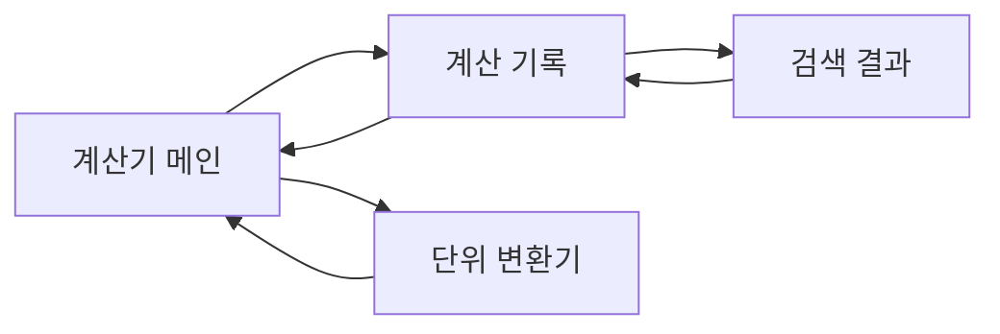
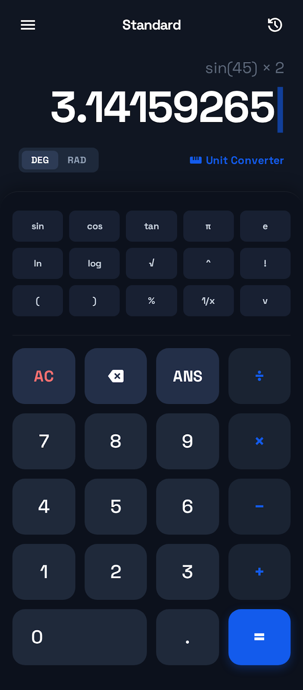
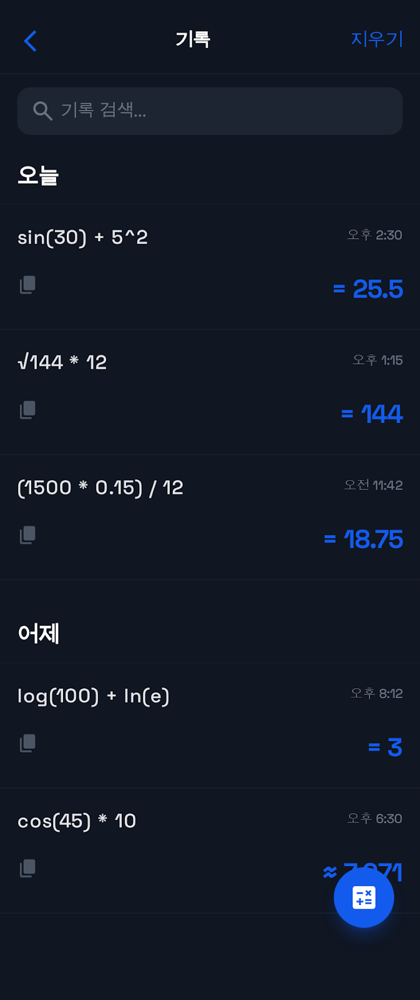
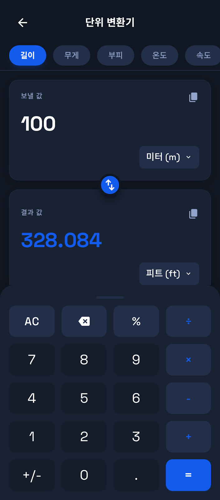

# PRD: 공학용 전자계산기 웹앱
**Engineering Calculator Web Application**

---

## 1. 제품 개요 (Product Overview)

### 1.1 목적 (Purpose)
공학용 전자계산기 웹앱은 과학 및 공학 계산, 계산 기록 관리, 단위 변환 기능을 통합한 모던한 웹 기반 계산기 애플리케이션입니다.

### 1.2 목표 사용자 (Target Users)
- 학생 (수학, 물리, 공학 전공)
- 엔지니어 및 과학자
- 일상적인 과학 계산이 필요한 일반 사용자

### 1.3 핵심 가치 제안 (Value Proposition)
- **통합 솔루션**: 계산기, 기록, 단위 변환을 하나의 앱에서 제공
- **모던한 UI/UX**: 다크 모드 기반의 세련된 인터페이스
- **접근성**: 웹 기반으로 어디서나 사용 가능
- **효율성**: 계산 기록 검색 및 재사용 기능

---

## 2. 기능 요구사항 (Functional Requirements)

### 2.1 공학용 계산기 (Scientific Calculator)

#### 2.1.1 디스플레이 영역
- **이전 표현식 표시**: 최근 계산식을 상단에 희미하게 표시
- **메인 결과 표시**: 
  - 큰 폰트 (56px)로 현재 입력/결과 표시
  - 커서 위치를 파란색 깜빡이는 커서로 표시
  - 긴 숫자는 자동 줄바꿈

#### 2.1.2 각도 단위 토글
- DEG (도) / RAD (라디안) 전환
- 세그먼트 버튼 UI로 구현
- 현재 선택된 단위는 하이라이트 표시

#### 2.1.3 과학 함수 키패드 (5열 그리드)
**1행**: `sin`, `cos`, `tan`, `π`, `e`
**2행**: `ln`, `log`, `√`, `^` (거듭제곱), `!` (팩토리얼)
**3행**: `(`, `)`, `%`, `1/x`, `v` (더보기/확장)

- 더보기 버튼 (`v`): 호버 시 확장 아이콘으로 변경
- 작은 크기의 컴팩트한 버튼 (높이 40px)

#### 2.1.4 표준 키패드 (4열 그리드)
**기능 행**: `AC` (빨간색), `⌫` (백스페이스), `ANS` (이전 답), `÷`
**숫자 행**:
- `7`, `8`, `9`, `×`
- `4`, `5`, `6`, `−`
- `1`, `2`, `3`, `+`
- `0` (2칸), `.`, `=` (파란색 강조)

- 숫자 버튼: 흰색 배경 (라이트 모드) / 어두운 배경 (다크 모드)
- 연산자 버튼: 파란색 배경/텍스트
- 큰 크기 (높이 72px)

#### 2.1.5 추가 기능
- **Unit Converter 버튼**: 단위 변환 화면으로 이동
- **History 버튼**: 우측 상단, 계산 기록 화면으로 이동
- **Menu 버튼**: 좌측 상단 (향후 확장용)

---

### 2.2 계산 기록 (Calculation History)

#### 2.2.1 상단 네비게이션
- **뒤로가기 버튼**: 계산기 화면으로 복귀
- **제목**: "기록" (중앙 정렬)
- **지우기 버튼**: 전체 기록 삭제

#### 2.2.2 검색 기능
- 검색 입력 필드 (플레이스홀더: "기록 검색...")
- 돋보기 아이콘
- 포커스 시 파란색 링 강조

#### 2.2.3 기록 목록
**섹션 헤더**:
- "오늘", "어제" 등 날짜별 그룹화
- 각 섹션 아래 구분선

**기록 아이템**:
- **계산식**: 상단 좌측 (큰 폰트)
- **시간**: 상단 우측 (작은 폰트, 회색)
- **결과**: 하단 우측 (큰 폰트, 파란색)
- **복사 버튼**: 하단 좌측 (아이콘)

예시:
```
sin(30) + 5²                    오후 2:30
[복사]                          = 25.5
```

#### 2.2.4 인터랙션
- 아이템 호버 시 배경 색상 변경
- 복사 버튼 클릭 시 결과값 복사
- 아이템 클릭 시 계산기로 복귀하며 해당 계산식 로드 (옵션)

#### 2.2.5 플로팅 액션 버튼 (FAB)
- 우측 하단 고정
- 계산기 아이콘
- 클릭 시 계산기 화면으로 복귀

---

### 2.3 단위 변환기 (Unit Converter)

#### 2.3.1 상단 네비게이션
- **뒤로가기 버튼**: 계산기로 복귀
- **제목**: "단위 변환기" (중앙 정렬)

#### 2.3.2 카테고리 칩
수평 스크롤 가능한 칩 목록:
- **길이** (활성)
- 무게
- 부피
- 온도
- 속도
- 데이터

활성 칩: 파란색 배경, 흰색 텍스트, 그림자
비활성 칩: 회색 배경, 회색 텍스트

#### 2.3.3 변환 카드
**입력 카드 (보낼 값)**:
- 라벨: "보낼 값" (상단 좌측, 작은 폰트)
- 복사 버튼 (상단 우측)
- 값 입력 필드 (큰 폰트, 읽기 전용 표시용)
- 단위 선택 드롭다운 (하단 우측)
  - 예: "미터 (m)"

**스왑 버튼**:
- 두 카드 사이에 배치된 원형 버튼
- 파란색 배경, 흰색 아이콘
- 클릭 시 180도 회전 애니메이션

**출력 카드 (결과 값)**:
- 라벨: "결과 값" (상단 좌측)
- 복사 버튼 (상단 우측)
- 결과값 표시 (큰 폰트, 파란색)
- 단위 선택 드롭다운
  - 예: "피트 (ft)"

#### 2.3.4 키패드
표준 계산기 키패드 (4열 그리드):
- `AC`, `⌫`, `%`, `÷`
- `7`, `8`, `9`, `×`
- `4`, `5`, `6`, `-`
- `1`, `2`, `3`, `+`
- `+/-`, `0`, `.`, `=`

#### 2.3.5 단위 변환 카테고리별 단위 목록

**길이**:
- 미터 (m), 센티미터 (cm), 킬로미터 (km)
- 피트 (ft), 인치 (in), 마일 (mi), 야드 (yd)

**무게**:
- 킬로그램 (kg), 그램 (g), 밀리그램 (mg), 톤 (t)
- 파운드 (lb), 온스 (oz)

**부피**:
- 리터 (L), 밀리리터 (mL), 세제곱미터 (m³)
- 갤런 (gal), 파인트 (pt), 쿼트 (qt)

**온도**:
- 섭씨 (°C), 화씨 (°F), 켈빈 (K)

**속도**:
- m/s, km/h, mph, knots

**데이터**:
- 바이트 (B), 킬로바이트 (KB), 메가바이트 (MB), 기가바이트 (GB), 테라바이트 (TB)
- 비트 (bit), 킬로비트 (Kbit), 메가비트 (Mbit)

---

## 3. 비기능 요구사항 (Non-Functional Requirements)

### 3.1 디자인 & UI/UX

#### 3.1.1 색상 팔레트
- **Primary**: `#135bec` (파란색)
- **Background Dark**: `#101622` / `#111722`
- **Surface Dark**: `#1e2532` / `#192233`
- **Key Function**: `#232f48`
- **Key Number**: `#1a2332`

#### 3.1.2 타이포그래피
- **Display Font**: Space Grotesk (영문, 숫자)
- **Body Font**: Noto Sans / Noto Sans KR (한글, 본문)
- **크기**:
  - 메인 결과: 56px, bold
  - 이전 표현식: 20px, normal
  - 기록 결과: 24px, bold
  - 버튼 텍스트: 20-24px

#### 3.1.3 모던 인터랙션
- 버튼 호버: 배경색 변화
- 버튼 클릭: `active:scale-95` (축소 애니메이션)
- 전환: 부드러운 transition-all
- 그림자: 레이어 깊이 표현
- 둥근 모서리: 버튼 16-24px, 카드 24px

#### 3.1.4 다크 모드
- 기본값: 다크 모드
- 라이트 모드 지원 (옵션)

### 3.2 성능
- 초기 로딩 시간: < 2초
- 계산 응답 시간: < 100ms
- 부드러운 스크롤 및 애니메이션 (60fps)

### 3.3 반응형 디자인
- 모바일 우선 설계
- 최소 너비: 360px
- 최대 너비: 480px (계산기 영역)
- 태블릿/데스크톱에서도 모바일 레이아웃 유지

### 3.4 접근성 (Accessibility)
- 키보드 네비게이션 지원
- 스크린 리더 호환 (ARIA 레이블)
- 충분한 색상 대비 (WCAG AA)

### 3.5 브라우저 호환성
- Chrome, Safari, Firefox, Edge (최신 2버전)
- 모바일 브라우저 (iOS Safari, Chrome Android)

---

## 4. 기술 요구사항 (Technical Requirements)

### 4.1 프론트엔드
- **프레임워크**: HTML, CSS, JavaScript (또는 React/Vue/Svelte)
- **CSS 프레임워크**: Tailwind CSS (디자인 기반)
- **아이콘**: Material Symbols Outlined
- **폰트**: Google Fonts (Space Grotesk, Noto Sans KR)

### 4.2 계산 엔진
- 정확한 부동소수점 계산
- 과학 함수 라이브러리 (Math.js 또는 자체 구현)
- 각도 단위 변환 (DEG ↔ RAD)
- 표현식 파싱 및 평가

### 4.3 데이터 저장
- **로컬 저장소**: LocalStorage 또는 IndexedDB
- **저장 내용**:
  - 계산 기록 (최대 100개)
  - 각도 단위 설정 (DEG/RAD)
  - 단위 변환 마지막 선택 값

### 4.4 단위 변환 로직
- 각 카테고리별 변환 공식
- 실시간 계산 (입력값 변경 시)
- 정확도: 소수점 6자리

---

## 5. 사용자 스토리 (User Stories)

### 5.1 계산기
**US-1**: 기본 계산  
사용자로서, 나는 사칙연산(+, -, ×, ÷)을 수행하여 빠르게 답을 얻고 싶다.

**US-2**: 과학 함수 계산  
사용자로서, 나는 삼각함수(sin, cos, tan), 로그(ln, log), 제곱근(√) 등을 계산하고 싶다.

**US-3**: 각도 단위 전환  
사용자로서, 나는 DEG와 RAD를 전환하여 각도 단위를 선택하고 싶다.

**US-4**: 이전 답 재사용  
사용자로서, 나는 ANS 버튼을 눌러 이전 계산 결과를 현재 계산에 사용하고 싶다.

### 5.2 계산 기록
**US-5**: 기록 조회  
사용자로서, 나는 과거 계산 기록을 날짜별로 조회하고 싶다.

**US-6**: 기록 검색  
사용자로서, 나는 검색창에 키워드를 입력하여 특정 계산식을 찾고 싶다.

**US-7**: 결과 복사  
사용자로서, 나는 기록의 결과값을 클립보드에 복사하여 다른 앱에서 사용하고 싶다.

**US-8**: 기록 삭제  
사용자로서, 나는 "지우기" 버튼을 눌러 모든 기록을 삭제하고 싶다.

### 5.3 단위 변환
**US-9**: 카테고리 선택  
사용자로서, 나는 길이, 무게, 부피 등 원하는 카테고리를 선택하고 싶다.

**US-10**: 단위 변환  
사용자로서, 나는 값을 입력하고 두 단위를 선택하여 실시간으로 변환 결과를 보고 싶다.

**US-11**: 단위 스왑  
사용자로서, 나는 스왑 버튼을 눌러 입력 단위와 출력 단위를 바꾸고 싶다.

**US-12**: 결과 복사  
사용자로서, 나는 변환된 결과값을 복사하여 다른 곳에 사용하고 싶다.

---

## 6. 화면 흐름 (Screen Flow)



**네비게이션**:
- 계산기 → 기록: 우측 상단 "history" 버튼
- 계산기 → 단위 변환: "Unit Converter" 버튼
- 기록/단위 변환 → 계산기: 좌측 상단 "뒤로가기" 버튼

---

## 7. 우선순위 (Priority)

### Phase 1 (MVP)
- [x] 공학용 계산기 UI
- [x] 기본 사칙연산
- [x] 과학 함수 (sin, cos, tan, log, ln, √, ^, !)
- [x] DEG/RAD 전환
- [ ] 계산 기록 저장 및 조회
- [ ] 단위 변환 (길이, 무게, 온도)

### Phase 2
- [ ] 계산 기록 검색
- [ ] 단위 변환 (부피, 속도, 데이터)
- [ ] 복사 기능
- [ ] 키보드 단축키

### Phase 3
- [ ] 라이트 모드
- [ ] 고급 과학 함수 (sin⁻¹, cos⁻¹, tan⁻¹, etc.)
- [ ] 계산 기록 내보내기 (CSV/JSON)
- [ ] PWA 지원 (오프라인, 설치)

---

## 8. 성공 지표 (Success Metrics)

- **사용성**: 80% 이상의 사용자가 튜토리얼 없이 모든 기능 사용 가능
- **성능**: 계산 응답 < 100ms, 화면 전환 < 300ms
- **만족도**: 사용자 설문 평균 4.5/5.0 이상
- **재사용률**: 월 활성 사용자의 70% 이상이 계산 기록을 1회 이상 조회

---

## 9. 향후 확장 계획 (Future Enhancements)

- **그래프 기능**: 함수 그래프 그리기
- **방정식 풀이**: 1차, 2차 방정식 자동 해결
- **행렬 계산**: 행렬 연산 지원
- **다국어 지원**: 영어, 일본어, 중국어
- **테마 커스터마이징**: 색상 및 폰트 선택
- **클라우드 동기화**: 여러 기기 간 기록 동기화

---

## 10. 디자인 스크린샷 (Design Screenshots)

### 10.1 계산기 메인 화면
공학용 계산기의 메인 인터페이스로, 디스플레이 영역, 과학 함수 키패드, 표준 수치 키패드를 포함합니다.



### 10.2 계산 기록 화면
날짜별로 그룹화된 계산 기록 목록, 검색 기능, 복사 기능을 제공하는 화면입니다.



### 10.3 단위 변환 화면
카테고리별 단위 변환 인터페이스로, 입력/출력 카드와 스왑 기능을 제공합니다.



---

## 11. 참고 디자인 (Design References)

본 PRD는 다음 디자인 파일을 기반으로 작성되었습니다:

- **계산기 메인 화면**: [calculator.html](design/calculator.html), [calculator.png](design/calculator.png)
- **계산 기록 화면**: [history.html](design/history.html), [history.png](design/history.png)
- **단위 변환 화면**: [unit-converter.html](design/unit-converter.html), [unit-converter.png](design/unit-converter.png)

모든 디자인은 Tailwind CSS 기반으로 구현되었으며, Material Design 아이콘을 사용합니다.

---

**문서 버전**: 1.0  
**작성일**: 2025-12-24  
**작성자**: Antigravity AI
