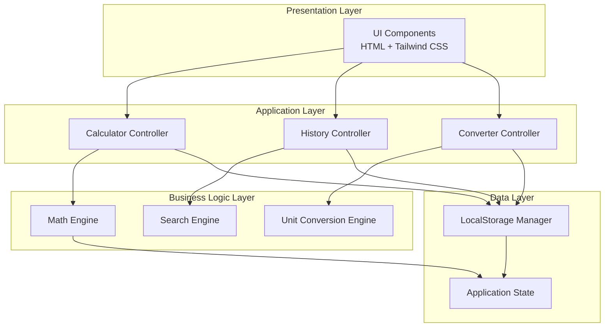

# Tech Spec: 공학용 전자계산기 웹앱
**Engineering Calculator Web Application - Technical Specification**

---

## 1. 문서 개요 (Document Overview)

### 1.1 목적
본 문서는 공학용 전자계산기 웹앱의 기술적 구현 사양을 정의합니다. 기술 스택, 아키텍처, 프로젝트 구조, 개발 및 배포 프로세스를 포함합니다.

### 1.2 관련 문서
- **PRD**: [PRD.md](file:///c:/Code/Calculator/Demo-Calculator/Demo-Calculator/docs/PRD.md) - 제품 요구사항 정의

### 1.3 버전 정보
- **문서 버전**: 1.0
- **작성일**: 2025-12-24
- **최종 수정일**: 2025-12-24

---

## 2. 기술 스택 (Technology Stack)

### 2.1 프론트엔드 코어

#### 2.1.1 언어 및 런타임
- **HTML5**: 시맨틱 마크업
- **CSS3**: 스타일링 및 애니메이션
- **JavaScript (ES6+)**: 애플리케이션 로직
  - 모듈 시스템: ES Modules (`import`/`export`)
  - 비동기 처리: `async`/`await`, Promises

#### 2.1.2 CSS 프레임워크
- **Tailwind CSS** (v3.x via CDN)
  - 커스텀 설정:
    ```javascript
    {
      darkMode: "class",
      theme: {
        extend: {
          colors: {
            primary: "#135bec",
            "background-light": "#f6f6f8",
            "background-dark": "#101622",
            "surface-dark": "#1e2532",
            "key-func": "#232f48",
            "key-num": "#1a2332"
          },
          fontFamily: {
            display: ["Space Grotesk", "sans-serif"],
            body: ["Noto Sans", "Noto Sans KR", "sans-serif"]
          }
        }
      }
    }
    ```
  - 플러그인: Forms, Container Queries

#### 2.1.3 폰트 및 아이콘
- **Google Fonts**:
  - Space Grotesk (300, 400, 500, 600, 700)
  - Noto Sans KR (300, 400, 500, 700)
- **아이콘**: Material Symbols Outlined (Google Fonts)

### 2.2 계산 엔진

#### 2.2.1 수학 라이브러리
**Option 1: Math.js** (권장)
- 정확한 부동소수점 연산
- 복소수, 분수, 단위 변환 지원
- 표현식 파싱 및 평가
- CDN: `https://cdnjs.cloudflare.com/ajax/libs/mathjs/12.x.x/math.min.js`

**Option 2: 자체 구현**
- `Math` 객체 활용
- 표현식 파서 구현 (Shunting Yard 알고리즘)
- 정밀도 제한 고려

선택 기준: Phase 1에서는 Math.js 사용, 성능/용량 이슈 시 자체 구현 고려

#### 2.2.2 지원 함수
**기본 연산**: `+`, `-`, `×`, `÷`, `%`, `^`  
**삼각함수**: `sin`, `cos`, `tan`, `asin`, `acos`, `atan`  
**로그**: `log` (log₁₀), `ln` (logₑ)  
**기타**: `√` (sqrt), `!` (factorial), `π`, `e`, `1/x`

### 2.3 데이터 저장

#### 2.3.1 로컬 스토리지
- **API**: `localStorage` (Web Storage API)
- **저장 데이터**:
  - 계산 기록: 최대 100개 (FIFO)
  - 설정: 각도 단위 (DEG/RAD), 다크 모드
  - 단위 변환 마지막 선택값
- **데이터 구조**:
  ```javascript
  {
    history: [
      {
        id: "uuid-v4",
        expression: "sin(30) + 5^2",
        result: "25.5",
        timestamp: 1703401234567,
        angleUnit: "DEG"
      }
    ],
    settings: {
      angleUnit: "DEG", // "DEG" | "RAD"
      darkMode: true,
      lastUnitCategory: "length"
    },
    unitConverter: {
      length: { from: "m", to: "ft", value: "100" }
    }
  }
  ```

#### 2.3.2 IndexedDB (Phase 2+)
- 대용량 기록 관리
- 오프라인 데이터 동기화 (PWA)

### 2.4 빌드 도구

#### 2.4.1 개발 서버
- **Vite** (v5.x) - 빠른 HMR, ES Modules 지원
- 대안: Live Server (VS Code Extension) - 간단한 개발용

#### 2.4.2 번들러
- **Vite** (프로덕션 빌드)
  - Rollup 기반
  - 코드 스플리팅
  - Tree shaking
  - Minification

### 2.5 패키지 관리
- **npm** (Node.js 18+ LTS)
- **package.json**:
  ```json
  {
    "name": "engineering-calculator",
    "version": "1.0.0",
    "type": "module",
    "scripts": {
      "dev": "vite",
      "build": "vite build",
      "preview": "vite preview",
      "test": "vitest"
    },
    "devDependencies": {
      "vite": "^5.0.0",
      "vitest": "^1.0.0"
    },
    "dependencies": {
      "mathjs": "^12.0.0"
    }
  }
  ```

---

## 3. 프로젝트 구조 (Project Structure)

```
Demo-Calculator/
├── docs/                   # 문서
│   ├── PRD.md
│   ├── TechSpec.md
│   └── design/             # 디자인 참고 파일
├── src/                    # 소스 코드
│   ├── index.html          # 메인 HTML (계산기)
│   ├── history.html        # 계산 기록 페이지
│   ├── converter.html      # 단위 변환 페이지
│   ├── styles/             # 스타일
│   │   ├── main.css        # 전역 스타일
│   │   └── tailwind.css    # Tailwind 커스터마이징
│   ├── scripts/            # JavaScript 모듈
│   │   ├── main.js         # 메인 앱 진입점
│   │   ├── calculator/     # 계산기 모듈
│   │   │   ├── Calculator.js       # 계산기 클래스
│   │   │   ├── Display.js          # 디스플레이 로직
│   │   │   ├── Keypad.js           # 키패드 이벤트
│   │   │   └── MathEngine.js       # 수식 평가
│   │   ├── history/        # 기록 모듈
│   │   │   ├── HistoryManager.js   # 기록 관리
│   │   │   ├── HistoryView.js      # 기록 UI
│   │   │   └── SearchEngine.js     # 검색 기능
│   │   ├── converter/      # 단위 변환 모듈
│   │   │   ├── UnitConverter.js    # 변환 로직
│   │   │   ├── ConversionRates.js  # 변환 계수
│   │   │   └── ConverterView.js    # 변환 UI
│   │   ├── storage/        # 데이터 저장
│   │   │   └── LocalStorage.js     # 로컬 저장소 래퍼
│   │   └── utils/          # 유틸리티
│   │       ├── constants.js        # 상수 정의
│   │       ├── helpers.js          # 헬퍼 함수
│   │       └── validators.js       # 입력 검증
│   └── assets/             # 정적 자산
│       ├── icons/          # 커스텀 아이콘 (필요시)
│       └── fonts/          # 로컬 폰트 (옵션)
├── tests/                  # 테스트
│   ├── unit/               # 단위 테스트
│   └── integration/        # 통합 테스트
├── public/                 # 정적 파일 (빌드 시 복사)
│   ├── favicon.ico
│   └── manifest.json       # PWA 매니페스트 (Phase 3)
├── .github/                # GitHub 설정
│   └── workflows/
│       └── deploy.yml      # GitHub Actions CI/CD
├── .gitignore
├── package.json
├── vite.config.js
└── README.md
```

---

## 4. 아키텍처 설계 (Architecture Design)

### 4.1 전체 아키텍처



### 4.2 모듈 설계 패턴

#### 4.2.1 MVC (Model-View-Controller) 변형
- **Model**: 데이터 및 비즈니스 로직 (MathEngine, UnitConverter, HistoryManager)
- **View**: UI 렌더링 (Display, HistoryView, ConverterView)
- **Controller**: 사용자 입력 처리 (Keypad, Event Handlers)

#### 4.2.2 모듈 패턴
```javascript
// Calculator.js 예시
class Calculator {
  constructor(displayElement, keypadElement) {
    this.display = new Display(displayElement);
    this.keypad = new Keypad(keypadElement, this.handleInput.bind(this));
    this.mathEngine = new MathEngine();
    this.state = {
      currentExpression: '',
      previousExpression: '',
      result: null,
      angleUnit: 'DEG'
    };
  }

  handleInput(key) {
    // 입력 처리 로직
  }

  calculate() {
    // 계산 실행
  }

  clear() {
    // 초기화
  }
}

export default Calculator;
```

### 4.3 상태 관리

#### 4.3.1 애플리케이션 상태
```javascript
// State Structure
const appState = {
  calculator: {
    currentExpression: '',
    previousExpression: '',
    result: null,
    angleUnit: 'DEG', // 'DEG' | 'RAD'
    cursor: { position: 0 }
  },
  history: {
    items: [],
    searchQuery: '',
    filteredItems: []
  },
  converter: {
    category: 'length',
    input: { value: '100', unit: 'm' },
    output: { value: '328.084', unit: 'ft' }
  },
  ui: {
    darkMode: true,
    activeScreen: 'calculator' // 'calculator' | 'history' | 'converter'
  }
};
```

#### 4.3.2 상태 업데이트 패턴
- **단방향 데이터 흐름**: Action → State Update → View Render
- **Reactive Updates**: Custom Event 시스템 또는 Observer 패턴

```javascript
// Event-driven state updates
class AppState {
  constructor() {
    this.state = { /* initial state */ };
    this.listeners = [];
  }

  setState(newState) {
    this.state = { ...this.state, ...newState };
    this.notify();
  }

  subscribe(listener) {
    this.listeners.push(listener);
  }

  notify() {
    this.listeners.forEach(listener => listener(this.state));
  }
}
```

---

## 5. 핵심 모듈 상세 (Core Modules)

### 5.1 계산 엔진 (MathEngine)

#### 5.1.1 표현식 평가 전략
**Math.js 사용 시**:
```javascript
import { evaluate, pi, e } from 'mathjs';

class MathEngine {
  constructor(angleUnit = 'DEG') {
    this.angleUnit = angleUnit;
  }

  evaluate(expression) {
    try {
      const processedExpr = this.preprocessExpression(expression);
      const result = evaluate(processedExpr, this.getScope());
      return this.formatResult(result);
    } catch (error) {
      throw new Error('Invalid expression');
    }
  }

  preprocessExpression(expr) {
    // × → *, ÷ → /, sin(30) → sin(30deg) if DEG mode
    let processed = expr.replace(/×/g, '*').replace(/÷/g, '/');
    
    if (this.angleUnit === 'DEG') {
      // 삼각함수 각도 변환
      processed = processed.replace(
        /(sin|cos|tan)\(([^)]+)\)/g,
        (match, func, angle) => `${func}((${angle}) * pi / 180)`
      );
    }
    
    return processed;
  }

  getScope() {
    return { pi, e };
  }

  formatResult(result) {
    // 정밀도 조정 (최대 10자리)
    return parseFloat(result.toPrecision(10));
  }
}
```

#### 5.1.2 지원 함수 매핑
```javascript
const FUNCTION_MAP = {
  'sin': 'sin',
  'cos': 'cos',
  'tan': 'tan',
  'ln': 'log',
  'log': 'log10',
  '√': 'sqrt',
  '^': '^',
  '!': 'factorial',
  'π': 'pi',
  'e': 'e'
};
```

### 5.2 단위 변환 엔진 (UnitConverter)

#### 5.2.1 변환 계수 데이터
```javascript
// ConversionRates.js
const CONVERSION_RATES = {
  length: {
    base: 'm', // 기준 단위
    units: {
      m: 1,
      cm: 100,
      km: 0.001,
      ft: 3.28084,
      in: 39.3701,
      mi: 0.000621371,
      yd: 1.09361
    }
  },
  weight: {
    base: 'kg',
    units: {
      kg: 1,
      g: 1000,
      mg: 1000000,
      t: 0.001,
      lb: 2.20462,
      oz: 35.274
    }
  },
  temperature: {
    // 특수 처리: 비선형 변환
    conversions: {
      'C-F': (c) => (c * 9/5) + 32,
      'F-C': (f) => (f - 32) * 5/9,
      'C-K': (c) => c + 273.15,
      'K-C': (k) => k - 273.15,
      'F-K': (f) => ((f - 32) * 5/9) + 273.15,
      'K-F': (k) => ((k - 273.15) * 9/5) + 32
    }
  }
  // ... 나머지 카테고리
};
```

#### 5.2.2 변환 로직
```javascript
class UnitConverter {
  convert(value, fromUnit, toUnit, category) {
    if (category === 'temperature') {
      return this.convertTemperature(value, fromUnit, toUnit);
    }
    
    const rates = CONVERSION_RATES[category];
    const baseValue = value / rates.units[fromUnit];
    const result = baseValue * rates.units[toUnit];
    
    return this.formatResult(result);
  }

  convertTemperature(value, from, to) {
    const key = `${from}-${to}`;
    return CONVERSION_RATES.temperature.conversions[key](value);
  }

  formatResult(result) {
    return parseFloat(result.toPrecision(6));
  }
}
```

### 5.3 기록 관리 (HistoryManager)

#### 5.3.1 기록 저장
```javascript
class HistoryManager {
  constructor(storage) {
    this.storage = storage;
    this.maxItems = 100;
  }

  addItem(expression, result, angleUnit = 'DEG') {
    const item = {
      id: crypto.randomUUID(),
      expression,
      result,
      angleUnit,
      timestamp: Date.now()
    };

    const history = this.getHistory();
    history.unshift(item); // 최신순 정렬

    // 최대 개수 제한
    if (history.length > this.maxItems) {
      history.pop();
    }

    this.storage.set('history', history);
    return item;
  }

  getHistory() {
    return this.storage.get('history') || [];
  }

  clearHistory() {
    this.storage.set('history', []);
  }

  search(query) {
    const history = this.getHistory();
    return history.filter(item =>
      item.expression.toLowerCase().includes(query.toLowerCase()) ||
      item.result.toString().includes(query)
    );
  }

  groupByDate(items) {
    const now = new Date();
    const today = new Date(now.getFullYear(), now.getMonth(), now.getDate());
    const yesterday = new Date(today);
    yesterday.setDate(yesterday.getDate() - 1);

    return {
      today: items.filter(item => new Date(item.timestamp) >= today),
      yesterday: items.filter(item => {
        const date = new Date(item.timestamp);
        return date >= yesterday && date < today;
      }),
      older: items.filter(item => new Date(item.timestamp) < yesterday)
    };
  }
}
```

### 5.4 로컬 스토리지 래퍼

```javascript
// LocalStorage.js
class LocalStorageManager {
  constructor(prefix = 'calc_') {
    this.prefix = prefix;
  }

  get(key) {
    try {
      const value = localStorage.getItem(this.prefix + key);
      return value ? JSON.parse(value) : null;
    } catch (error) {
      console.error('LocalStorage get error:', error);
      return null;
    }
  }

  set(key, value) {
    try {
      localStorage.setItem(this.prefix + key, JSON.stringify(value));
      return true;
    } catch (error) {
      console.error('LocalStorage set error:', error);
      return false;
    }
  }

  remove(key) {
    localStorage.removeItem(this.prefix + key);
  }

  clear() {
    const keys = Object.keys(localStorage);
    keys.forEach(key => {
      if (key.startsWith(this.prefix)) {
        localStorage.removeItem(key);
      }
    });
  }
}
```

---

## 6. UI/UX 구현 전략

### 6.1 반응형 디자인

#### 6.1.1 Tailwind 브레이크포인트
```javascript
// tailwind.config.js
theme: {
  screens: {
    'sm': '360px',  // 최소 모바일
    'md': '480px',  // 큰 모바일
    'lg': '768px',  // 태블릿 (데스크톱에서도 모바일 레이아웃)
  }
}
```

#### 6.1.2 viewport 설정
```html
<meta name="viewport" content="width=device-width, initial-scale=1.0, maximum-scale=1.0, user-scalable=no">
```

### 6.2 애니메이션 및 전환

#### 6.2.1 CSS 트랜지션
```css
/* main.css */
.btn {
  @apply transition-all duration-200 ease-in-out;
}

.btn:active {
  @apply scale-95;
}

.screen-transition {
  @apply transition-opacity duration-300;
}
```

#### 6.2.2 JavaScript 애니메이션
```javascript
// 화면 전환 애니메이션
function navigateTo(screen) {
  const current = document.querySelector('.screen.active');
  const next = document.querySelector(`.screen[data-screen="${screen}"]`);

  current.classList.add('fade-out');
  
  setTimeout(() => {
    current.classList.remove('active', 'fade-out');
    next.classList.add('active', 'fade-in');
  }, 300);
}
```

### 6.3 접근성 (Accessibility)

#### 6.3.1 ARIA 레이블
```html
<button aria-label="Calculate result" class="btn-equals">=</button>
<button aria-label="Delete last character" class="btn-backspace">⌫</button>
```

#### 6.3.2 키보드 네비게이션
```javascript
// 키보드 단축키 지원
document.addEventListener('keydown', (e) => {
  const keyMap = {
    'Enter': '=',
    'Backspace': 'backspace',
    'Escape': 'AC',
    '0-9': 'number',
    '+-*/': 'operator'
  };
  
  // Handle keyboard input
});
```

---

## 7. 테스트 전략 (Testing Strategy)

### 7.1 테스트 철학

#### 7.1.1 테스트 범위
**자동화 테스트 (TDD)**:
- ✅ **코어 비즈니스 로직**: MathEngine, UnitConverter, HistoryManager
- ✅ **데이터 처리**: Storage, Validators, Formatters
- ✅ **상태 관리**: CalculatorState, 옵저버 패턴
- ✅ **유틸리티**: 헬퍼 함수, 변환 로직

**수동 테스트**:
- 🖱️ **UI 컴포넌트**: Display, Keypad, HistoryView, ConverterView
- 🖱️ **사용자 인터랙션**: 버튼 클릭, 키보드 입력, 애니메이션
- 🖱️ **시각적 요소**: 레이아웃, 색상, 반응형 디자인
- 🖱️ **브라우저 호환성**: Chrome, Safari, Firefox, Edge

> **중요**: UI 렌더링, DOM 조작, 사용자 이벤트는 자동화 테스트 대상이 아닙니다.

### 7.2 단위 테스트 (Unit Tests)

#### 7.2.1 테스트 프레임워크
- **Vitest** (Vite 네이티브 테스트 러너)
- Jest 호환 API
- 빠른 실행 속도

#### 7.2.2 테스트 대상 (코어 로직만)
```javascript
// tests/unit/calculator/MathEngine.test.js
import { describe, it, expect } from 'vitest';
import MathEngine from '@/scripts/calculator/MathEngine.js';

describe('MathEngine', () => {
  it('should evaluate basic arithmetic', () => {
    const engine = new MathEngine();
    expect(engine.evaluate('2 + 2')).toBe(4);
    expect(engine.evaluate('10 - 5')).toBe(5);
    expect(engine.evaluate('3 * 4')).toBe(12);
    expect(engine.evaluate('8 / 2')).toBe(4);
  });

  it('should handle trigonometric functions in DEG mode', () => {
    const engine = new MathEngine('DEG');
    expect(engine.evaluate('sin(30)')).toBeCloseTo(0.5, 5);
    expect(engine.evaluate('cos(60)')).toBeCloseTo(0.5, 5);
  });

  it('should handle trigonometric functions in RAD mode', () => {
    const engine = new MathEngine('RAD');
    expect(engine.evaluate('sin(pi/2)')).toBeCloseTo(1, 5);
  });
});

// tests/unit/storage/LocalStorage.test.js
describe('LocalStorageImpl', () => {
  it('should save and retrieve data', () => {
    const storage = new LocalStorageImpl();
    const data = { key: 'value' };
    
    storage.save('test', data);
    const retrieved = storage.get('test');
    
    expect(retrieved).toEqual(data);
  });
});
```

#### 7.2.3 커버리지 목표
- **코어 로직**: 90% 이상 (필수)
- **유틸리티**: 85% 이상 (필수)
- **전체 프로젝트**: 70% 이상 (UI 제외)

> **참고**: UI 컴포넌트는 커버리지 계산에서 제외됩니다.

### 7.3 통합 테스트 (Integration Tests)

**범위**: 코어 로직 모듈 간 통합만 테스트

```javascript
// tests/integration/CalculatorCore.test.js
describe('Calculator Core Integration', () => {
  it('should calculate and save to history', () => {
    // 코어 로직 간 통합 테스트
    const mathEngine = new MathEngine();
    const storage = new LocalStorageImpl();
    const historyManager = new HistoryManager(storage);
    
    // 계산 수행
    const result = mathEngine.evaluate('2 + 2');
    expect(result).toBe(4);
    
    // 기록 저장
    historyManager.addItem('2 + 2', result);
    const history = historyManager.getHistory();
    
    // 기록 확인
    expect(history).toHaveLength(1);
    expect(history[0].expression).toBe('2 + 2');
    expect(history[0].result).toBe('4');
  });
  
  it('should convert units correctly', () => {
    const converter = new UnitConverter();
    const result = converter.convert(100, 'm', 'ft', 'length');
    
    expect(result).toBeCloseTo(328.084, 2);
  });
});
```

### 7.4 UI 테스트 (수동)

#### 7.4.1 테스트 체크리스트
UI는 **수동으로** 다음 항목을 검증합니다:

**계산기 UI**:
- [ ] 버튼 클릭 시 올바른 값 입력됨
- [ ] 키보드 입력 동작 확인
- [ ] 디스플레이에 표현식 정확히 표시
- [ ] 계산 결과 정확히 표시
- [ ] 에러 발생 시 에러 메시지 표시
- [ ] DEG/RAD 토글 작동
- [ ] 애니메이션 부드럽게 동작

**기록 UI**:
- [ ] 기록 목록 정확히 표시
- [ ] 날짜별 그룹화 올바름
- [ ] 검색 기능 동작
- [ ] 복사 버튼 작동 (클립보드에 복사됨)
- [ ] 전체 삭제 작동

**단위 변환 UI**:
- [ ] 카테고리 전환 동작
- [ ] 단위 선택 동작
- [ ] 변환 결과 정확히 표시
- [ ] 스왑 버튼 작동 및 애니메이션

#### 7.4.2 브라우저 테스트
각 브라우저에서 수동으로 테스트:
- [ ] Chrome (최신 2버전)
- [ ] Safari (최신 2버전)
- [ ] Firefox (최신 2버전)
- [ ] Edge (최신 2버전)
- [ ] Mobile: iOS Safari, Chrome Android

#### 7.4.3 반응형 테스트
다양한 화면 크기에서 레이아웃 확인:
- [ ] Mobile: 360px - 480px
- [ ] Tablet: 768px - 1024px
- [ ] Desktop: 1280px+

### 7.5 E2E 테스트

**E2E 테스트는 구현하지 않습니다.**

향후 필요 시 수동 테스트 시나리오를 문서화하여 사용합니다.

---

## 8. 빌드 및 배포 (Build & Deployment)

### 8.1 개발 환경

#### 8.1.1 로컬 개발
```bash
# 의존성 설치
npm install

# 개발 서버 시작 (http://localhost:5173)
npm run dev

# 테스트 실행
npm run test
```

#### 8.1.2 Vite 설정
```javascript
// vite.config.js
import { defineConfig } from 'vite';
import path from 'path';

export default defineConfig({
  root: 'src',
  base: './', // GitHub Pages 호환
  resolve: {
    alias: {
      '@': path.resolve(__dirname, './src')
    }
  },
  build: {
    outDir: '../dist',
    emptyOutDir: true,
    rollupOptions: {
      input: {
        main: path.resolve(__dirname, 'src/index.html'),
        history: path.resolve(__dirname, 'src/history.html'),
        converter: path.resolve(__dirname, 'src/converter.html')
      }
    }
  },
  server: {
    port: 5173,
    open: true
  }
});
```

### 8.2 프로덕션 빌드

```bash
# 빌드 실행
npm run build

# 빌드 미리보기
npm run preview
```

**빌드 최적화**:
- Minification (HTML, CSS, JS)
- Tree shaking (미사용 코드 제거)
- Code splitting (라우트별 분리)
- Asset optimization (이미지 압축)

### 8.3 CI/CD (GitHub Actions)

#### 8.3.1 워크플로우 설정
```yaml
# .github/workflows/deploy.yml
name: Deploy to GitHub Pages

on:
  push:
    branches: [ main ]
  pull_request:
    branches: [ main ]

jobs:
  build-and-deploy:
    runs-on: ubuntu-latest
    
    steps:
    - name: Checkout
      uses: actions/checkout@v4
    
    - name: Setup Node.js
      uses: actions/setup-node@v4
      with:
        node-version: '18'
        cache: 'npm'
    
    - name: Install dependencies
      run: npm ci
    
    - name: Run tests
      run: npm run test
    
    - name: Build
      run: npm run build
    
    - name: Deploy to GitHub Pages
      if: github.ref == 'refs/heads/main'
      uses: peaceiris/actions-gh-pages@v3
      with:
        github_token: ${{ secrets.GITHUB_TOKEN }}
        publish_dir: ./dist
```

#### 8.3.2 GitHub Pages 설정
- **Repository Settings** → **Pages**
- **Source**: Deploy from a branch
- **Branch**: `gh-pages` / root
- **URL**: `https://[username].github.io/Demo-Calculator/`

---

## 9. 성능 최적화 (Performance Optimization)

### 9.1 로딩 성능

#### 9.1.1 CDN 리소스
```html
<!-- 폰트 preconnect -->
<link rel="preconnect" href="https://fonts.googleapis.com">
<link rel="preconnect" href="https://fonts.gstatic.com" crossorigin>

<!-- Critical CSS inline -->
<style>
  /* 초기 렌더링에 필요한 최소 CSS */
</style>

<!-- Defer non-critical resources -->
<link rel="stylesheet" href="styles/main.css" media="print" onload="this.media='all'">
```

#### 9.1.2 Lazy Loading
```javascript
// 단위 변환 데이터는 필요시 로드
const loadConversionData = async (category) => {
  const module = await import(`./data/${category}.js`);
  return module.default;
};
```

### 9.2 런타임 성능

#### 9.2.1 Debounce/Throttle
```javascript
// 검색 입력 디바운스
const debounce = (func, delay) => {
  let timeoutId;
  return (...args) => {
    clearTimeout(timeoutId);
    timeoutId = setTimeout(() => func(...args), delay);
  };
};

const handleSearch = debounce((query) => {
  const results = historyManager.search(query);
  renderResults(results);
}, 300);
```

#### 9.2.2 메모이제이션
```javascript
// 변환 결과 캐싱
const memoize = (fn) => {
  const cache = new Map();
  return (...args) => {
    const key = JSON.stringify(args);
    if (cache.has(key)) return cache.get(key);
    const result = fn(...args);
    cache.set(key, result);
    return result;
  };
};

const convert = memoize(unitConverter.convert.bind(unitConverter));
```

### 9.3 번들 크기 최적화

**목표**:
- Initial bundle: < 100KB (gzipped)
- Total assets: < 500KB

**전략**:
- Tailwind CSS purging (미사용 클래스 제거)
- Math.js 부분 import
- 코드 스플리팅

---

## 10. 보안 고려사항 (Security)

### 10.1 입력 검증
```javascript
// XSS 방지: 입력값 sanitization
const sanitizeInput = (input) => {
  const div = document.createElement('div');
  div.textContent = input;
  return div.innerHTML;
};
```

### 10.2 안전한 표현식 평가
```javascript
// eval() 사용 금지
// Math.js의 안전한 evaluate() 사용
// 또는 화이트리스트 기반 파싱
```

### 10.3 CSP (Content Security Policy)
```html
<meta http-equiv="Content-Security-Policy" 
      content="default-src 'self'; 
               script-src 'self' https://cdn.tailwindcss.com https://cdnjs.cloudflare.com; 
               style-src 'self' 'unsafe-inline' https://fonts.googleapis.com; 
               font-src 'self' https://fonts.gstatic.com;">
```

---

## 11. 개발 가이드라인

### 11.1 코딩 스타일

#### 11.1.1 JavaScript
- **ESLint**: Airbnb 스타일 가이드
- **Prettier**: 코드 포매팅
- 네이밍: camelCase (변수/함수), PascalCase (클래스)

#### 11.1.2 CSS
- Tailwind utility classes 우선 사용
- 커스텀 CSS는 `@layer` 사용
- BEM 네이밍 (필요시)

### 11.2 Git 워크플로우
- **브랜치 전략**: GitHub Flow
  - `main`: 프로덕션
  - `feature/*`: 기능 개발
  - `fix/*`: 버그 수정
- **커밋 메시지**: Conventional Commits
  - `feat:`, `fix:`, `docs:`, `style:`, `refactor:`, `test:`, `chore:`

### 11.3 코드 리뷰 체크리스트
- [ ] 테스트 작성 및 통과
- [ ] ESLint 경고 없음
- [ ] 접근성 고려
- [ ] 성능 영향 검토
- [ ] 문서 업데이트

---

## 12. 향후 기술 로드맵

### Phase 2
- **상태 관리 라이브러리**: Zustand 또는 Pinia (필요시)
- **PWA**: Service Worker, Web App Manifest
- **IndexedDB**: Dexie.js

### Phase 3
- **프레임워크 마이그레이션**: React/Vue/Svelte (선택적)
- **TypeScript**: 타입 안정성 향상
- **WebAssembly**: 고성능 계산 (대용량 연산)

---

## 13. 참고 자료 (References)

### 13.1 문서
- [Vite Documentation](https://vitejs.dev/)
- [Tailwind CSS](https://tailwindcss.com/docs)
- [Math.js](https://mathjs.org/docs/)
- [MDN Web Docs](https://developer.mozilla.org/)

### 13.2 디자인 시스템
- [Material Design 3](https://m3.material.io/)
- [Google Fonts](https://fonts.google.com/)

---

**문서 버전**: 1.0  
**작성일**: 2025-12-24  
**최종 검토**: 2025-12-24  
**작성자**: Antigravity AI
